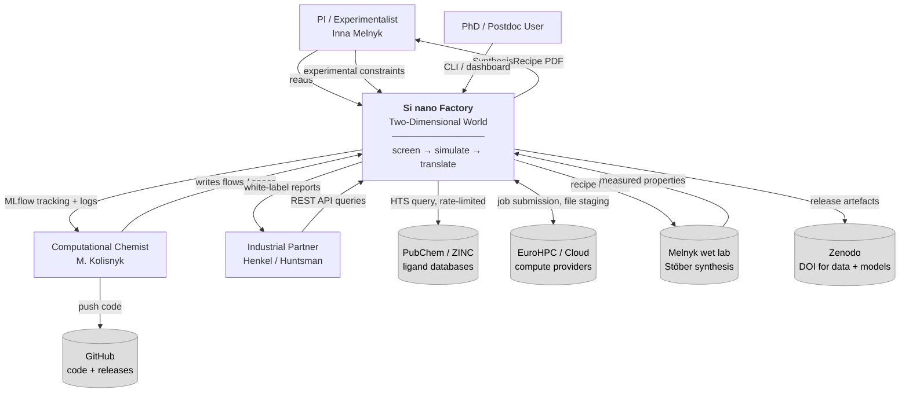
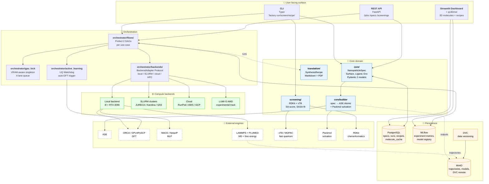
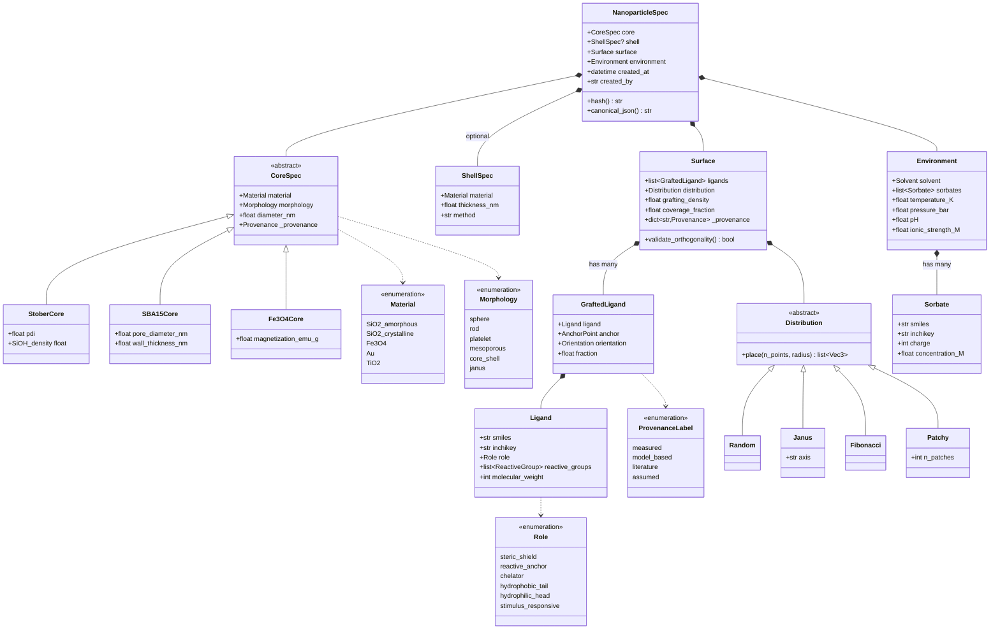
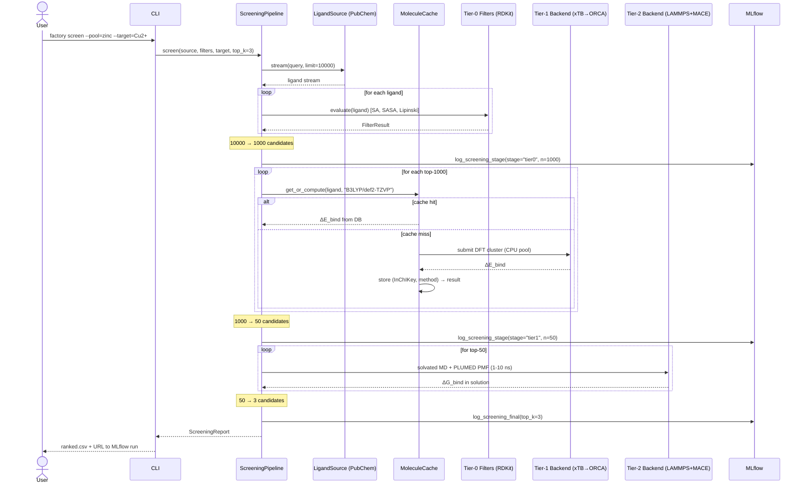
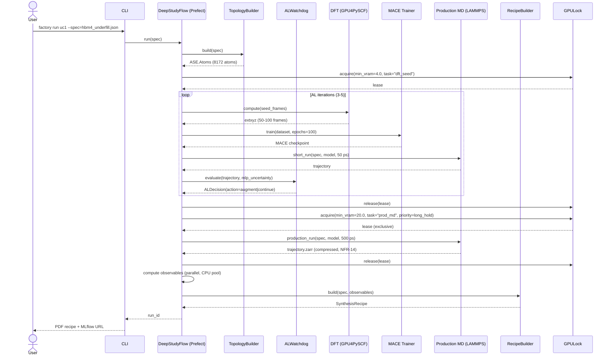
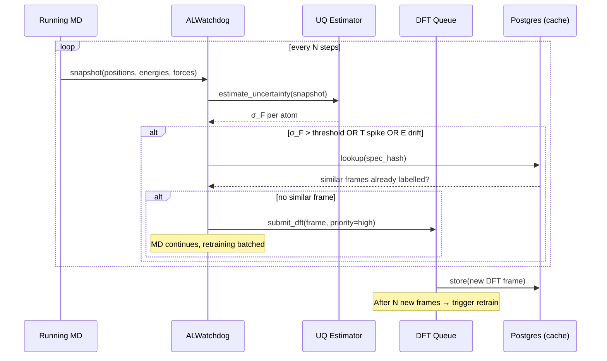
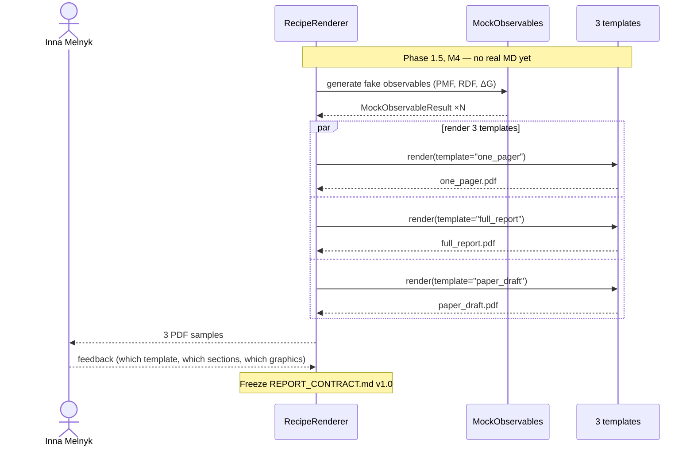
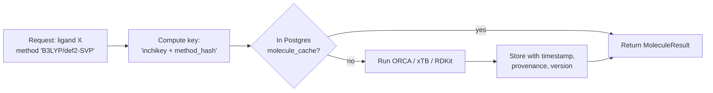
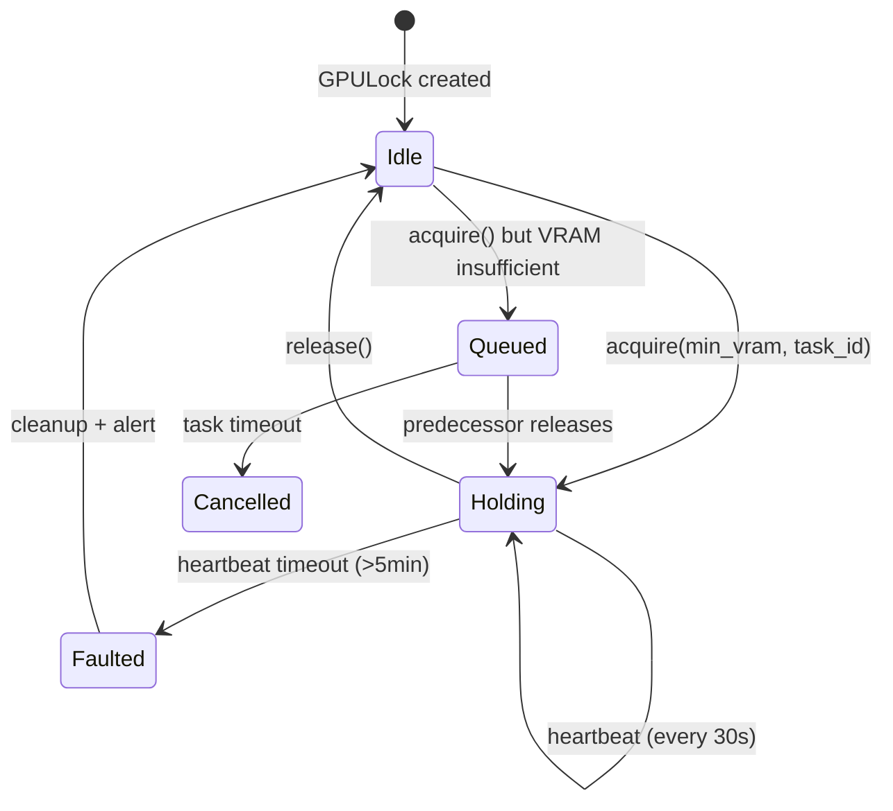

# Architecture — Si nano Factory (Two-Dimensional World)

> **Документ:** Architectural blueprint v0.1
> **Статус:** DRAFT для PI-затвердження
> **Audience:** core developer (M.K.), code-review agents, future contributors
> **Призначення:** зафіксувати контракти між модулями ДО написання коду, щоб уникнути переписування API
> **Базується на:** [00_TZ.md](./00_TZ.md) v0.2, [MASTER_PROMPT.md](./MASTER_PROMPT.md), [DEVELOPMENT_SETUP.md](./DEVELOPMENT_SETUP.md)

---

## 0. Як читати цей документ

Структура — за моделлю **C4** (Context → Container → Component → Code) з
доповненнями (sequence diagrams, ADRs).

| Розділ | Що міститься | Для кого |
|---|---|---|
| §1 | System Context (хто з ким говорить) | усі |
| §2 | Container view (процеси та сервіси) | dev + DevOps |
| §3 | Surface-centric data model (philosophy → schema) | dev + PI |
| §4 | Module contracts (Protocol stubs) | dev (core reading) |
| §5 | Backend Adapter (HPC abstraction) | dev + ops |
| §6 | Sequence diagrams (4 ключових flows) | dev |
| §7 | Cross-cutting concerns (provenance, cache, GPU lock) | dev |
| §8 | ADRs (журнал архітектурних рішень) | усі |

**Принцип «контракти-перш-за-код»:** жоден Protocol/ABC у §4-§5 не повинен
бути переписаний при імплементації Module 1-4. Якщо переписуємо — це сигнал
до ADR-update, не silent change.

---

## 1. System Context (C4 Level 1)



**Key observation.** Усі зовнішні системи мають bidirectional arrows — це не
data sink, це **dialogue** з кожним стейкхолдером. Архітектура має тримати ці
канали відкритими (PubChem rate limit → §7.2 cache; HPC offline → §5
backend-fallback; wet-lab feedback → §6.3 AL loop).

---

## 2. Container View (C4 Level 2)

> «Container» у C4 = окремий процес/сервіс/база (не Docker container per se,
> хоча часто збігається).



### 2.1 Container responsibilities (одним рядком кожен)

| Container | Owns | Doesn't own |
|---|---|---|
| `core/` | Pydantic schema, topology builder, hash | flow execution, persistence, compute |
| `screening/` | Tier-0 cheminformatics + Tier-1 fast quantum | full DFT, MD |
| `orchestrator/` | DAGs, GPU lock, backend selection, AL trigger | the actual physics |
| `translation/` | observables → SynthesisRecipe → PDF/MD | computing observables |
| Postgres | metadata, specs, runs, molecule cache | binary blobs |
| MinIO | binary blobs (trajectories, checkpoints) | metadata |
| MLflow | per-run metrics, model registry | raw data (delegates to MinIO) |
| Backends | "where to run" abstraction | "what to run" (that's flow) |

**Anti-rule.** Жоден container з лівої колонки **не може** дотягуватись до
тулзи з правої колонки безпосередньо. Усе через Protocol-інтерфейси (§4-§5).

---

## 3. Surface-Centric Data Model (C4 Level 3 — for `core/`)

> Філософія PI: «Уся хімія = поверхня. Bulk core — boundary condition».
> Це не маркетинг — це обмеження для схеми.

### 3.1 Class diagram (Mermaid)



### 3.2 Інваріанти схеми (валідуються Pydantic-валідаторами)

| Інваріант | Де перевіряємо | Чому |
|---|---|---|
| `sum(ligand.fraction for ligand in surface.ligands) == 1.0` | `Surface.model_validator` | Покриття дорівнює 100% |
| `surface.grafting_density <= material.max_grafting_density` | те ж | Хімічна правдоподібність |
| Якщо `Distribution == Janus` — щонайменше 2 ligands у `surface.ligands` | те ж | Janus = двоокий за визначенням |
| Якщо `Role == reactive_anchor` — `Ligand.reactive_groups` не порожній | `Ligand.model_validator` | Не можна "якорем" без активної групи |
| `inchikey` обчислюється з SMILES, не зберігається окремо | `Ligand.model_validator` | Уникаємо drift; cache key детермінований |
| `_provenance[field]` існує для кожного float-поля | `Surface.model_validator` | NFR: усі числа мають походження |

### 3.3 Hash strategy (для cache key + reproducibility)

```python
def hash(self) -> str:
    """SHA-256 канонізованого JSON.
    Канонізація: keys sorted, float repr fixed (8 decimal places),
    enums as their .value, datetime stripped (це metadata, не identity)."""
```

**Інваріант:** два `NanoparticleSpec` з однаковим `hash()` ⇒ однакова фізична
система. Перевірка через property-based test (Hypothesis) у Phase 1.

---

## 4. Module Contracts (Protocol stubs)

> Це **API frozen** — будь-яка зміна після M3 потребує ADR.
> Конкретні класи живуть у `sinanofactory/{core,screening,orchestrator,translation}/`.

### 4.1 Module 1 — core builder

```python
from typing import Protocol
from pathlib import Path
from ase import Atoms

class TopologyBuilder(Protocol):
    """Build atomistic topology from a NanoparticleSpec."""

    def build(self, spec: NanoparticleSpec) -> Atoms:
        """Return ASE.Atoms. Idempotent: same spec → same atoms (within seed)."""

    def build_to_disk(
        self,
        spec: NanoparticleSpec,
        output_dir: Path,
        formats: tuple[str, ...] = ("xyz", "lmpdat"),
    ) -> dict[str, Path]:
        """Build + write to disk in requested formats."""

    @property
    def supported_morphologies(self) -> set[Morphology]: ...
```

**Implementations** (Phase 1):
- `StoberSphereBuilder` — sphere з Fibonacci grafting (як у HBM4 PoC)
- `SBA15PoreBuilder` — гексагональний канал з функціоналізованими стінками
- `JanusBuilder` — wraps any base + applies bipolar mask
- `CoreShellBuilder` — wraps Fe3O4Core + adds SiO2 shell

### 4.2 Module 2 — ligand source + filter

```python
from typing import Protocol, Iterator

class LigandSource(Protocol):
    """Stream of candidate ligands from a remote/local DB."""

    name: str  # "pubchem", "zinc", "chembl", "local_csv"

    def stream(
        self,
        query: LigandQuery,
        limit: int | None = None,
    ) -> Iterator[Ligand]: ...

    def cache_dir(self) -> Path: ...
    def is_available(self) -> bool: ...

class LigandFilter(Protocol):
    """Decision: keep this ligand or drop it."""

    name: str  # "sa_score", "lipinski", "sasa_fit", "homo_lumo"

    def evaluate(self, ligand: Ligand) -> FilterResult:
        """Pure function. No side effects."""

class FilterResult(BaseModel):
    passed: bool
    score: float
    rationale: str
    provenance: ProvenanceLabel = ProvenanceLabel.model_based

class ScreeningPipeline(Protocol):
    """Compose multiple filters into a single rank function."""

    def screen(
        self,
        source: LigandSource,
        filters: list[LigandFilter],
        target: ScreeningTarget,
        top_k: int,
    ) -> ScreeningReport: ...
```

### 4.3 Module 3 — orchestrator

```python
from typing import Protocol
from prefect import Flow

class GPULock(Protocol):
    """Singleton VRAM-aware lock."""

    async def acquire(
        self,
        min_vram_gb: float,
        task_id: str,
        priority: TaskPriority = TaskPriority.NORMAL,
    ) -> GPULease: ...

    async def release(self, lease: GPULease) -> None: ...

    @property
    def available_vram_gb(self) -> float: ...

    @property
    def queue_depth(self) -> int: ...

class GPULease(BaseModel):
    """Token returned by GPULock.acquire. Use as async context manager."""
    lease_id: UUID
    granted_at: datetime
    expires_at: datetime
    holder_task_id: str
    vram_reserved_gb: float

class FlowFactory(Protocol):
    """Each use-case implements this."""

    use_case: str  # "uc1_hbm4", "uc2_ree", "uc3_heavy_metals", ...

    def screening_flow(self) -> Flow: ...
    def deep_study_flow(self) -> Flow: ...

class ActiveLearningWatchdog(Protocol):
    """Monitors a running MD job, decides when to trigger DFT augmentation."""

    def evaluate(
        self,
        snapshot: TrajectorySnapshot,
        mlp_uncertainty: UQEstimate,
    ) -> ALDecision:
        """ALDecision.action ∈ {continue, augment, halt}."""

class TaskPriority(IntEnum):
    INTERACTIVE = 0   # human waiting
    NORMAL = 10       # batch
    BACKGROUND = 50   # nightly screening
```

### 4.4 Module 4 — translator

```python
class ObservableComputer(Protocol):
    """Compute one named observable from a trajectory."""

    name: str  # "rdf", "pmf", "sasa", "delta_g_bind", "viscosity_proxy"

    def compute(
        self,
        trajectory: TrajectoryHandle,
        params: ObservableParams,
    ) -> ObservableResult: ...

class ObservableResult(BaseModel):
    name: str
    value: float | NDArray
    units: str
    provenance: ProvenanceLabel
    uncertainty: float | None = None
    metadata: dict[str, Any]

class RecipeBuilder(Protocol):
    """Glue layer: observables → SynthesisRecipe."""

    def build(
        self,
        spec: NanoparticleSpec,
        observables: list[ObservableResult],
        target: ScreeningTarget,
    ) -> SynthesisRecipe: ...

class RecipeRenderer(Protocol):
    """Render a recipe in a chosen format."""

    output_format: Literal["markdown", "pdf", "html", "json"]

    def render(self, recipe: SynthesisRecipe, output_path: Path) -> Path: ...

class SynthesisRecipe(BaseModel):
    """The final artefact handed to the experimentalist."""
    spec: NanoparticleSpec
    rationale: str  # "why these ligands, why this ratio"
    reagents: list[Reagent]
    procedure: list[ProcedureStep]
    expected_observables: dict[str, ObservableResult]
    confidence: ConfidenceLevel
    provenance_summary: dict[str, ProvenanceLabel]
```

---

## 5. Backend Adapter (HPC abstraction layer)

> Найважливіший контракт після `NanoparticleSpec`. Гарантує NFR-16
> (backend-agnostic core).

### 5.1 Protocol

```python
from typing import Protocol, AsyncIterator
from enum import StrEnum

class BackendKind(StrEnum):
    LOCAL = "local"
    SLURM = "slurm"
    AWS_BATCH = "aws_batch"
    GCP_BATCH = "gcp_batch"
    RUNPOD = "runpod"
    LUMI = "lumi"
    JURECA = "jureca"

class BackendCapabilities(BaseModel):
    """What this backend can/cannot do. Used by scheduler to filter."""
    kind: BackendKind
    max_vram_gb: float
    max_ram_gb: float
    max_walltime_hours: float
    has_internet: bool
    has_mpi: bool
    container_runtime: Literal["docker", "apptainer", "none"]
    cost_per_gpu_hour_usd: float | None  # None = free / academic
    supports_interactive: bool  # local=True, SLURM/cloud usually False

class Task(BaseModel):
    """Self-contained unit of work for a backend."""
    task_id: UUID
    command: list[str]                  # actual exec
    input_files: dict[Path, Path]       # local → remote
    output_files: dict[Path, Path]      # remote → local
    resource_request: ResourceRequest
    container_image: str | None
    env: dict[str, str]
    timeout_seconds: int
    metadata: dict[str, Any]            # for telemetry

class ResourceRequest(BaseModel):
    cpu_cores: int = 1
    ram_gb: float = 4.0
    gpus: int = 0
    min_vram_gb: float = 0.0
    walltime_hours: float = 1.0
    requires_internet: bool = False

class JobStatus(StrEnum):
    PENDING = "pending"
    QUEUED = "queued"
    RUNNING = "running"
    SUCCEEDED = "succeeded"
    FAILED = "failed"
    CANCELLED = "cancelled"
    TIMEOUT = "timeout"

class JobInfo(BaseModel):
    job_id: str  # backend-specific (SLURM job ID, AWS Batch ARN, ...)
    status: JobStatus
    submitted_at: datetime
    started_at: datetime | None
    finished_at: datetime | None
    exit_code: int | None
    queue_position: int | None
    cost_so_far_usd: float | None

class BackendAdapter(Protocol):
    """One backend = one implementation."""

    name: str
    capabilities: BackendCapabilities

    async def submit(self, task: Task) -> JobInfo: ...
    async def status(self, job_id: str) -> JobInfo: ...
    async def stream_logs(self, job_id: str) -> AsyncIterator[str]: ...
    async def cancel(self, job_id: str) -> None: ...

    async def stage_in(self, files: dict[Path, Path]) -> None: ...
    async def stage_out(self, files: dict[Path, Path]) -> None: ...

    def cost_estimate(self, task: Task) -> float: ...  # USD
    def can_run(self, task: Task) -> bool: ...
    def is_available(self) -> bool: ...               # health check
```

### 5.2 Backend selection algorithm (rule-based, v1.0)

```python
def choose_backend(
    task: Task,
    available: list[BackendAdapter],
    preferences: BackendPreferences,
) -> BackendAdapter:
    """Returns ONE backend. Raises NoFeasibleBackend if none can run task."""

    # 1. Hard filter: capability + availability
    feasible = [b for b in available if b.can_run(task) and b.is_available()]
    if not feasible:
        raise NoFeasibleBackend(task)

    # 2. Interactive priority → local if free
    if task.metadata.get("priority") == "interactive":
        local = next((b for b in feasible if b.kind == BackendKind.LOCAL), None)
        if local and local.is_available():
            return local

    # 3. Long-hold exclusive (Deep-Study D-Tier 3) → academic HPC (free)
    if (task.resource_request.walltime_hours > 12
        and task.resource_request.gpus >= 1):
        academic = [b for b in feasible
                    if b.capabilities.cost_per_gpu_hour_usd is None]
        if academic:
            return min(academic, key=lambda b: b.queue_wait_estimate(task))

    # 4. Embarrassingly parallel (S-Tier 1 batch) → cheapest cloud
    if task.metadata.get("parallelism") == "embarrassingly_parallel":
        cloud = [b for b in feasible if b.capabilities.cost_per_gpu_hour_usd]
        if cloud:
            return min(cloud, key=lambda b: b.cost_estimate(task))

    # 5. Default → cheapest available (with local as free baseline)
    return min(feasible, key=lambda b: b.cost_estimate(task))
```

> v2.0 замінить це на cost-aware MILP або RL-based scheduler. Поточний rule
> set покриває 90% реальних рішень.

### 5.3 Implementation matrix (хто будуємо коли)

| Adapter | Phase | Складність | Чим тестуємо |
|---|---|---|---|
| `LocalAdapter` | Phase 1 (M3) | low — wrapper над subprocess + GPULock | unit tests, реальні задачі |
| `SLURMAdapter` | Phase 2 (M5) | medium — `dask-jobqueue` або HyperQueue | mocked SLURM (test) + real SAS HPC (integration) |
| `RunPodAdapter` | Phase 2 (M6) | low-medium — REST API + S3 | sandbox account, $50 cap |
| `AWSBatchAdapter` | Phase 3 (M7) | medium — boto3 + Spot | LocalStack (test) + real AWS (staging) |
| `JURECAAdapter` | Phase 4 (M10) | medium — SSH proxy + sbatch | recorded fixtures |
| `LUMIAdapter` | Phase 4 (M11) | high — ROCm specifics | recorded fixtures |

---

## 6. Sequence Diagrams (4 ключових flows)

### 6.1 Screening Flow (S-Tier 0 → 1 → 2)



### 6.2 Deep-Study Flow (HBM4-style)



### 6.3 Active-Learning Watchdog (FR-32)



### 6.4 Cardboard Prototype delivery (M4 milestone)



---

## 7. Cross-cutting concerns

### 7.1 Provenance — обов'язкове на кожному float

Кожна числова метрика, що зберігається у `NanoparticleSpec`, `Surface`,
`ObservableResult`, `Recipe` повинна мати асоційований `ProvenanceLabel`:

| Label | Коли застосовується |
|---|---|
| `measured` | прямо обчислено з MD/DFT/AIMD траєкторії |
| `model_based` | результат constitutive law / fitting / mapping (e.g., Cross-Ostwald rheogram у HBM4) |
| `literature` | взято з опублікованої роботи з citation |
| `assumed` | educated guess (default value або користувацький estimate) |

**Enforcement.** Pydantic-валідатор у `Surface.model_validator` обходить
`__fields__`, для кожного `float`/`NDArray`/`Quantity` поля перевіряє:
`field.name in self._provenance`. Інакше — `ValidationError`.

**UI hint.** Streamlit dashboard кольорить картку залежно від worst-case
provenance:
- зелений: усі `measured`
- жовтий: ≥1 `model_based`
- помаранч: ≥1 `assumed`
- блакитний (info): ≥1 `literature`

### 7.2 Molecule Cache (FR-34, §5.4 ТЗ)



- **Key:** `(inchikey: str, method_hash: str)` — composite primary
- **No invalidation** — DFT за фіксованою методикою детермінована
- **Method change** — новий `method_hash` → новий запис, старі лишаються
- **Cross-UC reuse** — аміно-пропіл-силан рахується раз для всіх UC

### 7.3 GPU Lock (NFR-04, FR-11)



**Implementation.** Один global `asyncio.Lock` + named `Semaphore` per VRAM
budget tier. При `acquire()`:
1. Перевірка реального `nvidia-smi --query-gpu=memory.free`
2. Якщо `free < min_vram` → wait (queue depth tracked)
3. При grant → start heartbeat task
4. На `release()` або crash → free + notify queue

### 7.4 IP / Patent flag (R-06)

Один булевий стовпець у Postgres `factory_meta.runs.ip_protected: bool`. Потік:
```
Tier-2 result → check novelty (literature search)
              → IF novelty > 80% AND ΔG > threshold
              → set ip_protected=true
              → notification to PI
              → PI рев'ю в 5 робочих днів
              → IF patent: lock 12 months
              → IF not: auto-unlock + CC-BY release
```

Жодних license headers per file. Один CLI: `factory export --public` пропускає
рядки з `ip_protected=true`.

---

## 8. ADRs (Architectural Decision Records)

> Журнал важливих рішень. Після затвердження архітектури — кожна зміна = новий ADR.

### ADR-001: Surface-centric data model

- **Status:** Accepted (PI mandate)
- **Context:** Уся хімія — поверхнева. Bulk core виступає як boundary condition.
- **Decision:** `Surface` — first-class object у Pydantic-схемі. `CoreSpec` — periphery.
- **Consequences:** (+) точне відображення фізики; (+) валідатори природно
  ставляться на Surface; (−) неінтуїтивно для класичного materials-modeller'а
  (треба mental switch).

### ADR-002: Two flow shapes (Screening + Deep-Study), not single tier ladder

- **Status:** Accepted (after PI feedback v0.2)
- **Context:** PI запропонував tier-модель, в якій DFT передує MLP-MD.
  HBM4 PoC робив навпаки.
- **Decision:** Підтримуємо **обидва** flow-shapes одночасно. Screening
  (S-Tier 0/1/2) для широкого пошуку; Deep-Study (D-Tier 0-4) для
  narrative-paper-якості одного кандидата.
- **Consequences:** (+) Гнучкість; (+) HBM4 PoC fits as Deep-Study without
  rewrite; (−) Два DAG-шаблони замість одного → більше тестів.

### ADR-003: Time-based release, not dual-licensing

- **Status:** Accepted (counter to PI's initial recommendation)
- **Context:** PI пропонував dual-license (Apache-2.0 core + private weights).
- **Decision:** Один Apache-2.0 репо + `ip_protected: bool` flag → 6-12 міс. lock → auto-CC-BY release.
- **Consequences:** (+) Жодного license-header overhead; (+) Простіше для одного-двох розробників;
  (−) Менш formally enforceable — спирається на process discipline; (−) Якщо
  команда виросте до 10+ — rewrite policy.

### ADR-004: Backend Adapter як Protocol, не ABC

- **Status:** Accepted
- **Context:** Python має два механізми — `typing.Protocol` (structural) і `abc.ABC` (nominal).
- **Decision:** Усі cross-module contracts — `Protocol`. ABC залишаємо лише
  всередині модулів для shared base class з реальною логікою.
- **Consequences:** (+) Backends можуть бути third-party packages without
  inheritance dependency; (+) mock'ування простіше; (−) IDE autocomplete
  слабший без `typing-extensions @runtime_checkable`.

### ADR-005: Prefect 2 over Snakemake/Custom asyncio

- **Status:** Accepted (PI selection)
- **Context:** Three orchestration candidates.
- **Decision:** Prefect 2.19+.
- **Rationale:** UI з коробки, retry logic, native async, type-safe flows,
  good Postgres backend, простіша migration до Prefect Cloud якщо знадобиться.
- **Consequences:** (+) Швидкий start; (+) MLflow-friendly; (−) Vendor lock
  на Prefect's flow API; (−) Heavier ніж Snakemake для dead-simple use-cases.

### ADR-006: PostgreSQL для metadata, MinIO для blobs (не один Postgres)

- **Status:** Accepted
- **Context:** Бінарні artifacts (трае ~1 GB) можна було б у Postgres BYTEA.
- **Decision:** Розділяємо: Postgres = metadata + InChIKey cache + provenance;
  MinIO = blobs (трае, моделі, фігури).
- **Rationale:** Postgres backup/restore стає недієздатним при TB-scale BYTEA.
  S3-API дозволяє трансфер до cloud/HPC без зміни code.
- **Consequences:** (+) Скейлиться; (−) Два сервіси замість одного;
  (−) Requires consistent linking (UUID у Postgres → S3 key у MinIO).

### ADR-007: Provenance enforcement at Pydantic-validator level

- **Status:** Accepted
- **Context:** HBM4 PoC мав рисунки model-based, презентовані як measured.
  Це системна помилка, не випадкова.
- **Decision:** Усі float/NDArray поля у `Surface`/`ObservableResult` мусять
  мати `_provenance` запис; Pydantic raises на missing.
- **Consequences:** (+) Структурно неможливо приховати model-based; (+) UI/PDF
  можуть rendering different colours; (−) Boilerplate при створенні специ
  (mitigated factory functions з default `assumed`).

### ADR-008: Single .venv with uv, не Docker для розробки

- **Status:** Accepted
- **Context:** Альтернатива — full Docker dev container.
- **Decision:** `.venv` через `uv` для core dev. Docker лише для services
  (Postgres/MinIO/Prefect/MLflow). Apptainer для HPC (§14).
- **Rationale:** GPU passthrough в Docker dev container на WSL2 — біль;
  DevContainer slower than native venv.
- **Consequences:** (+) Швидкий iteration; (+) Native GPU access; (−) Less
  reproducible across team-members (mitigated by `uv.lock` + CI).

---

## 9. What this document does NOT specify

Свідомо залишене для пізніших ADR/specs:

1. **Конкретний MACE wrapper API** — буде у Phase 1 (code skeleton),
   орієнтуючись на upstream `mace.calculators.MACECalculator`
2. **Streamlit page structure** — М4 cardboard determines this
3. **REST endpoint payload schemas** — генерується з Pydantic-моделей FastAPI'ем
4. **Test pyramid proportions** — у `tests/README.md` пізніше
5. **CI/CD workflow YAML** — `.github/workflows/` у code skeleton phase
6. **Deployment for industrial partner** — Phase 4+, окремий ADR
7. **Multi-tenancy** — non-goal для v1.0 (single PI = single tenant)

---

## 10. Open architectural questions (для PI рев'ю)

1. **Async-first або sync-first?** Я схильний async для IO (backends, DB),
   sync для computational core (builder, screen). ОК?
2. **Pydantic v2 strict або lax mode?** Strict (pyflakes-style) гарантує
   correctness, але більше boilerplate. Я за strict. ОК?
3. **Чи варто обгортати всі external tools (ORCA, LAMMPS) у Protocol?**
   Я за — це робить мокування для тестів тривіальним. Альтернатива — пряме
   використання без shim layer (більше swap-cost при оновленнях upstream).
4. **JSON vs YAML для NanoparticleSpec на диску?** JSON — машинно-читабельне,
   YAML — людино. Може обидва (Pydantic вміє)? Я за JSON для CI, YAML для
   examples.
5. **Чи створювати окремий `sinanofactory.physics` шар** (RDF, PMF, SASA
   computers) як plug-in registry, чи тримати все в `translation/observables/`?

---

*Документ v0.1 · Si nano Factory — Two-Dimensional World*
